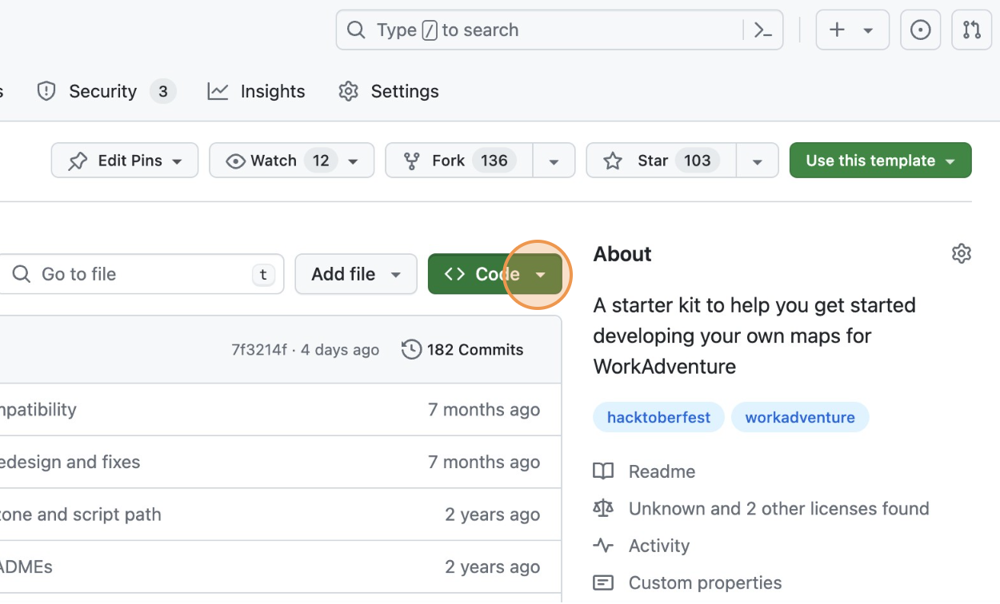
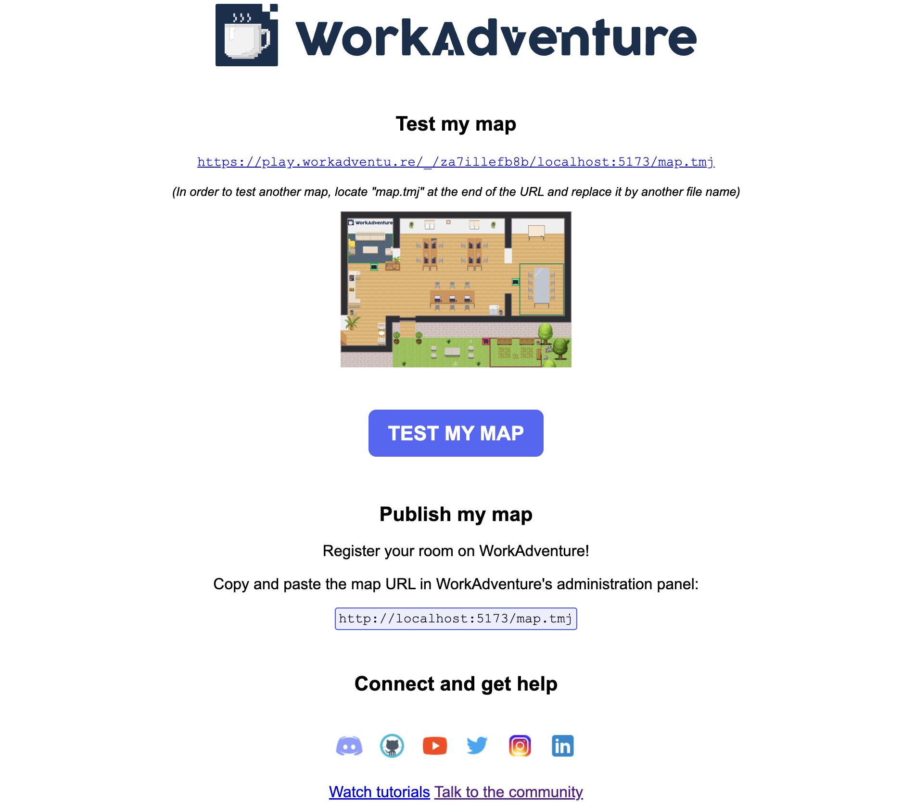

# Build your Map with Tiled

This document will guide you through the process of creating your own map for WorkAdventure using the **Tiled** editor.

:::info
If you are looking to do a simple customization of an existing map, like placing furniture or editing entries and
exits, you should read the [Customize your map](../inline-editor/index.md) guide instead.
:::

## Tools you will need

In order to build your own map for WorkAdventure, you need:

- the [WorkAdventure Map Starter Kit](https://github.com/workadventure/map-starter-kit)
- the [Tiled editor](https://www.mapeditor.org/) software
- "tiles" (i.e. images) to create your map
- [NodeJS](https://nodejs.org/en/download) to test your map locally and to upload it to the WorkAdventure server

## About the Map Starter Kit

WorkAdventure comes with a "map starter kit" that we highly recommend using to start designing your map quickly.
It contains **a good default tileset** for building an office and it contains tools to upload your map on WorkAdventure
or on Github Pages. It also comes with a local web server for testing purpose and with
TypeScript support (if you are looking to use the [Map Scripting API](/developer/map-scripting/)).

When designing your map with Tiled, there are a number of settings that [must absolutely be respected in order to be 
compatible with WorkAdventure](wa-maps.md). The "map starter kit" is already configured with these settings.

:::caution
Do not try to start a map from scratch. It is much easier to start from the "map starter kit" and customize it.
If you need to create additional maps, copy the "map starter kit" default map and customize it.
:::

## Downloading the Map Starter Kit

Go to the [Github map starter kit repository page](https://github.com/workadventure/map-starter-kit) and click the **"Code"** button.

Then click on the Download ZIP button

:::info
If you plan to do team-work on your map, it can be a good idea to put your map files on Git. This is especially true
if you plan to use the Scripting API to add some code in your map. If you plan to do so,
instead of downloading the ZIP file, you should use the map starter kit as a template.
If you want to do so, unfold the "Using GitHub to work on a map as a team" details section below.
:::

  
Using GitHub to work on map as a team

  

Start by [creating a GitHub account](https://github.com/join) if you don't already have one.

Then, go to the [Github map starter kit repository page](https://github.com/workadventure/map-starter-kit) and click the **"Use this template"** button.

You will be prompted to enter a repository name for your map.

  

## Customizing your map

### Loading the map in Tiled

The sample map is in the file `office.tmj`. You can load this file in [Tiled](https://www.mapeditor.org/).

Now, it's up to you to edit the map and write your own map.

Some resources regarding Tiled:

- [Tiled documentation](https://doc.mapeditor.org/en/stable/manual/introduction/)
- [Tiled video tutorials](https://www.gamefromscratch.com/post/2015/10/14/Tiled-Map-Editor-Tutorial-Series.aspx)

### Testing your map locally

In order to test your map, you need a web server to host your map. The "map starter kit" comes with a local web server that you can use to test your map.

To start this web server, you will need [Node.JS](https://nodejs.org/download/).

Download and install NodeJS.

Then, open your command line and from the directory of the map, run this command:

    $ npm install

This will install the local web server.

    $ npm run start

This command will start the web server and open the welcome page. You should see a page looking like this:

From here, you simply need to click the "Test this map" button to test your map in WorkAdventure.

:::warning
The local web server can only be used to test your map locally. In particular, the link will only work on your computer. You cannot share it with other people.
:::

### Adding more map files

If you want to add more maps to your project, no need to duplicate the whole starter kit.
Instead, simply copy and paste the `office.tmj` file. You can give any name to this file, but it must have the `.tmj` extension.

From here, you can access your map by modifying the URL in the browser and replacing `office.tmj` by your new map name.
For example, if you have a map named `map2.tmj`, you can access it by visiting `http://play.workadventure.localhost/_/some_random_chars/localhost:5137/map2.tmj`.

## Need some help?

WorkAdventure is a constantly evolving project and there is plenty of room for improvement regarding map editing.
If you are facing any troubles, do not hesitate to seek help in [our Discord server](https://discord.gg/G6Xh9ZM9aR) or open an "issue" in the [GitHub WorkAdventure account](https://github.com/thecodingmachine/workadventure/issues).
