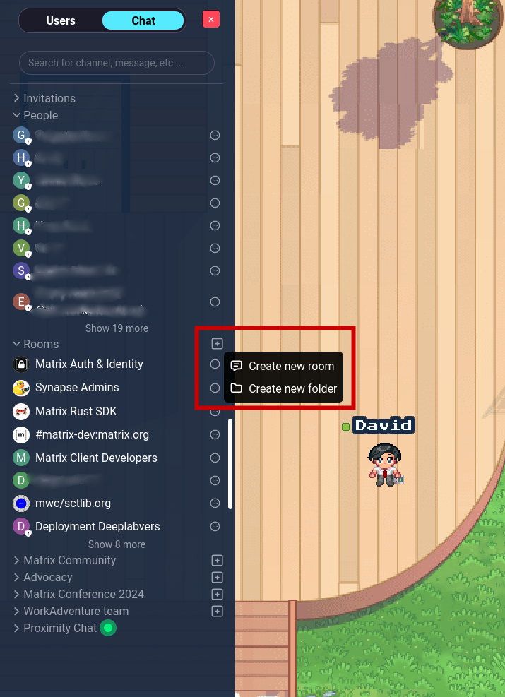
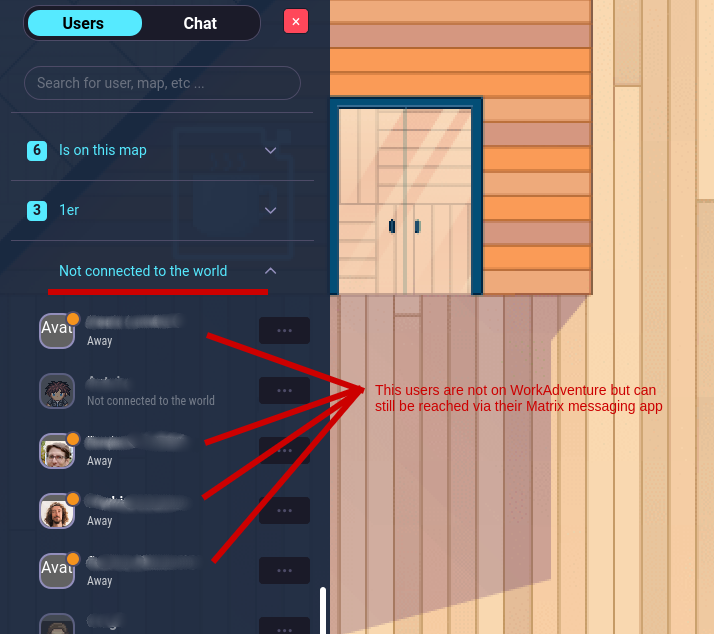

# Using the chat

:::note
Global settings for the chat are available in the admin panel. See the [admin documentation for more information](/admin/chat).
:::

The chat system can be accessed by clicking on the chat icon in the action bar.

2 types of chat rooms are available in WorkAdventure:

- **The Proximity chat room**
- **The "Matrix" chat rooms**

## Proximity chat room

This chat room comes with special rules.

It is the chat that is displayed in the conversation bubbles. It is always available.

Chat messages in the Proximity Chat are **only visible to users that are in the same conversation bubble as you**.

When a user moves in a conversation bubble, they cannot see the chat messages that were sent before they entered the bubble.

Messages in the Proximity Chat are **not stored**. If you refresh the page, the proximity chat room will be empty.

## "Matrix" chat rooms

Matrix chat rooms take their name from the Matrix protocol, which is used to provide chat features in WorkAdventure.

Matrix chat rooms are **persistent chat rooms**.

### Creating a chat room

Anyone logged can create a chat room. 

A click on the "+" icon next to the "Rooms" section will prompt a form to create a new chat room.

**Room visibility** can be set to "Public" or "Private". Public rooms are visible to **everyone**, while private rooms are 
only visible to users that have been invited to the room.

:::note
When we say public rooms are accessible to *everyone*, we mean it. The Matrix protocol is federated, and anyone with a 
Matrix account can join a public room. Even if they are not logged in WorkAdventure.
:::

**Encryption** can be enabled for private rooms. When enabled, messages in the chat room are encrypted using end-to-end encryption.
It means nobody except the participants of the room can read the messages. Not even the WorkAdventure server administrators.
Once a room has encryption enabled, it cannot be disabled.

The **Users** field can be used to invite users to the room. Users can be invited by their name or their Matrix ID (if you
want to invite users with a Matrix ID outside WorkAdventure to join).

**Who can read history** option can be used to decide what part of the chat history is visible to new users joining the room.

- **Anyone** means that new users can read the entire chat history.
- **Members only (since they joined)** means that new users can only read the chat history from the moment they joined the room.
- **Members only (since they were invited)** applies to private rooms. New users can only read the chat history from the moment they were invited to the room (even if they did not join the room at that time).

### Folders

Rooms can be organized in folders. Folders can be created by clicking on the "Create folder" button.

The folder notion in WorkAdventure is usually called a "space" in other Matrix client.

### Invitations

In order to open a chat with another user in your WorkAdventure world, you need to invite them to a chat room.
If you are creating a private room, you will also need to invite users.

Invited users will receive a notification in the chat room list and they can accept or decline the invitation.

## User list

The user list shows the list of users in relation with your world. In this list, you will see:

- **Online users**: Users that are currently connected to your world, whether they are members, visitors or anonymous users.
- **Disconnected users**: Users that are not currently connected to your world. The **Disconnected users** section will
  contain the list of members that are not currently connected to your world plus the list of users you have a direct
  connection with in Matrix.

So for instance, if one of your members is not connected to your world but is reachable through Matrix, you will see
them with a "green" or "orange" dot in the **Disconnected users** section.

## End-to-end encryption

End-to-end encryption brings the highest level of security, ensuring that even WorkAdventure administrators cannot read 
your messages. However, this means users become responsible for keeping their encryption key safe.

The first time you use encryption, WorkAdventure generates an encryption key that can be saved using a recovery passphrase.
Be sure to store this key securely or remember the recovery passphrase.

Since the encryption key is stored in your browser and never reaches WorkAdventure servers, if you access WorkAdventure 
from another browser, you'll need to provide this encryption key again to read your message history.

To keep WorkAdventure simple and avoid burdening first-time users, encryption is not enabled by default when you create 
a room or chat with a user. Enabling encryption is as easy as checking the "Active end-to-end encryption" box when creating
a room.

Please note that if you receive a message while you're away, WorkAdventure will send a **notification email**. In encrypted 
rooms, WorkAdventure cannot include a conversation snippet in the email because we can't decrypt the content. 
Therefore, we advise enabling end-to-end encryption only if you truly need the added level of privacy.

### Resetting Your Key Storage

If you need to reset your key storage, you can do so via the **Reset Your Key Storage** button located in the chat menu. However, proceed with caution:

**Only proceed if you have no other device with which to verify your session.**

Resetting the key storage will remove your current session and all trusted users. You could lose access to some past messages, and you will no longer be recognized as a trusted user. Make sure you fully understand the consequences of this action before proceeding.
